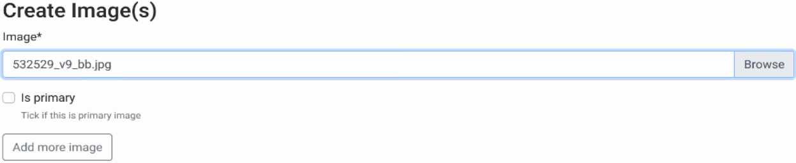
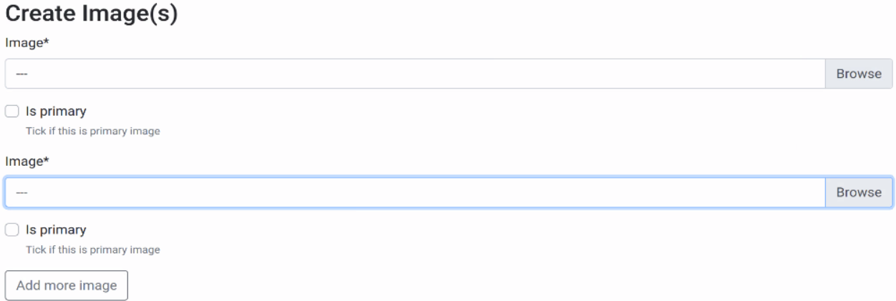
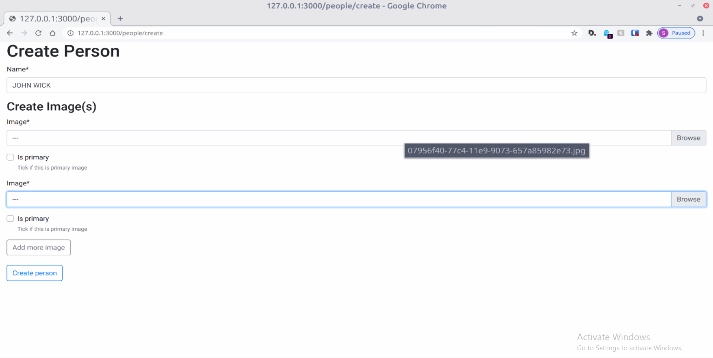

# Django Crispy Form ImageField example

I notice some issue using django-crispy-form (dcf), details of issue: <https://github.com/django-crispy-forms/django-crispy-forms/issues/1160>

Here is a basic example of dcf with Django ImageField

## Main Python Packages

- python: 3.9
- django: 3.2
- django-crispy-form: 1.11.2
- Template pack: Bootstrap4

## Python Setup

```bash
# since I am not sure which Python manager you are using, bash script is universal
# 1st activate your environment (conda / venv)
# execute this bash script that installs required python packages
./install_packages.sh

# django
./manage runserver
./manage migrate
./manage createsuperuser

# to test the problem
# go 127.0.0.1:<port>/person/create and upload > 1 images by clicking `Add more image`, you will see missing the filename
```

## Problem

I noticed that:

### Problem 1
**When there is multiple image inline formsets, the filenames do not appear after upload, but the files there because it will appear in database table once the form is submitted.**



If there is only single image inline formset, filename appear just fine.



In this image, you see 2 image upload, both with `---`, but I have already uploaded 2 images, thus problem 1.



Same example as previous image, both with `---`, but when hover, you will see the filename.

### Problem 2
**ImageField's `ClearableFileInput` do not follow the layout defined.**

If you refer to `person/forms.py`, you see that I have defined the layout, `is_primary` field should be before image field, but that is not the html generated, thus problem 2.

### Problem 3
In the `127.0.0.1:port/person/update`, I am only able to update the first image, not the 2nd or subsequent images. So I check the html, **only the first input tag's value is correct, the rest are incorrect**. I believe this is the problem.

```html
<div id="person_image_formset">
  <input
    type="hidden"
    name="person_image-0-id"
    value="1"
    id="id_person_image-0-id"
  />
  <div id="div_id_person_image-0-image" class="form-group">
    <label for="id_person_image-0-image" class="requiredField">
      Image<span class="asteriskField">*</span>
    </label>
    <div class="mb-2">
      <div class="input-group mb-2">
        <div class="input-group-prepend">
          <span class="input-group-text">Currently</span>
        </div>
        <div class="form-control d-flex h-auto">
          <span class="text-break" style="flex-grow: 1; min-width: 0">
            <a href="/media/07956f40-77c4-11e9-9073-657a85982e73_beWsn32.webp"
              >07956f40-77c4-11e9-9073-657a85982e73_beWsn32.webp</a
            >
          </span>
        </div>
      </div>
      <div class="input-group mb-0">
        <div class="input-group-prepend">
          <span class="input-group-text">Change</span>
        </div>
        <div class="form-control custom-file" style="border: 0">
          <input
            type="file"
            name="person_image-0-image"
            class="custom-file-input"
            accept="image/*"
            id="id_person_image-0-image"
          />
          <label
            class="custom-file-label text-truncate"
            for="id_person_image-0-image"
            >---</label
          >
          <script type="text/javascript" id="script-id_person_image-0-image">
            document
              .getElementById("script-id_person_image-0-image")
              .parentNode.querySelector(".custom-file-input").onchange =
              function (e) {
                var filenames = "";
                for (let i = 0; i < e.target.files.length; i++) {
                  filenames += (i > 0 ? ", " : "") + e.target.files[i].name;
                }
                e.target.parentNode.querySelector(
                  ".custom-file-label"
                ).textContent = filenames;
              };
          </script>
        </div>
      </div>
      <div class="input-group mb-0"></div>
    </div>
  </div>
  <div class="form-group">
    <div
      id="div_id_person_image-0-is_primary"
      class="custom-control custom-checkbox"
    >
      <input
        type="checkbox"
        name="person_image-0-is_primary"
        class="checkboxinput custom-control-input"
        id="id_person_image-0-is_primary"
      />
      <label for="id_person_image-0-is_primary" class="custom-control-label">
        Is primary
      </label>
      <small id="hint_id_person_image-0-is_primary" class="form-text text-muted"
        >Tick if this is primary image</small
      >
    </div>
  </div>
  <table class="no_error">
    <input
      type="hidden"
      name="csrfmiddlewaretoken"
      value="qOqrf7dJYoAhdXTT6RfD4Ebp5l3zKQoojaGDfxU1l61bg9JmlxL5Yb4Wkrxogjkk"
    />
    <input
      type="hidden"
      name="person_image-0-person"
      value="1"
      id="id_person_image-0-person"
    />
    <input
      type="hidden"
      name="person_image-0-id"
      value="1"
      id="id_person_image-0-id"
    />
  </table>

  <input
    type="hidden"
    name="person_image-1-id"
    value="2"
    id="id_person_image-1-id"
  />
  <div id="div_id_person_image-1-image" class="form-group">
    <label for="id_person_image-1-image" class="requiredField">
      Image<span class="asteriskField">*</span>
    </label>
    <div class="mb-2">
      <div class="input-group mb-2">
        <div class="input-group-prepend">
          <span class="input-group-text">Currently</span>
        </div>
        <div class="form-control d-flex h-auto">
          <span class="text-break" style="flex-grow: 1; min-width: 0">
            <a href="/media/JohnWickChapter3Promo_rNuYVcJ.webp"
              >JohnWickChapter3Promo_rNuYVcJ.webp</a
            >
          </span>
        </div>
      </div>
      <div class="input-group mb-0">
        <div class="input-group-prepend">
          <span class="input-group-text">Change</span>
        </div>
        <div class="form-control custom-file" style="border: 0">
          <input
            type="file"
            name="person_image-1-image"
            class="custom-file-input"
            accept="image/*"
            id="id_person_image-1-image"
          />
          <label
            class="custom-file-label text-truncate"
            for="id_person_image-1-image"
            >---</label
          >
          <script type="text/javascript" id="script-id_person_image-1-image">
            document
              .getElementById("script-id_person_image-1-image")
              .parentNode.querySelector(".custom-file-input").onchange =
              function (e) {
                var filenames = "";
                for (let i = 0; i < e.target.files.length; i++) {
                  filenames += (i > 0 ? ", " : "") + e.target.files[i].name;
                }
                e.target.parentNode.querySelector(
                  ".custom-file-label"
                ).textContent = filenames;
              };
          </script>
        </div>
      </div>
      <div class="input-group mb-0"></div>
    </div>
  </div>
  <div class="form-group">
    <div
      id="div_id_person_image-1-is_primary"
      class="custom-control custom-checkbox"
    >
      <input
        type="checkbox"
        name="person_image-1-is_primary"
        class="checkboxinput custom-control-input"
        id="id_person_image-1-is_primary"
      />
      <label for="id_person_image-1-is_primary" class="custom-control-label">
        Is primary
      </label>
      <small id="hint_id_person_image-1-is_primary" class="form-text text-muted"
        >Tick if this is primary image</small
      >
    </div>
  </div>
  <table class="no_error">
    <form method="post" enctype="multipart/form-data"></form>
    <input
      type="hidden"
      name="csrfmiddlewaretoken"
      value="qOqrf7dJYoAhdXTT6RfD4Ebp5l3zKQoojaGDfxU1l61bg9JmlxL5Yb4Wkrxogjkk"
    />
    <input
      type="hidden"
      name="person_image-1-person"
      value="1"                             ******************* this value is wrong, should be 2 instead of 1
      id="id_person_image-1-person"
    />
    <input
      type="hidden"
      name="person_image-1-id"
      value="2"
      id="id_person_image-1-id"
    />
  </table>
</div>
```
